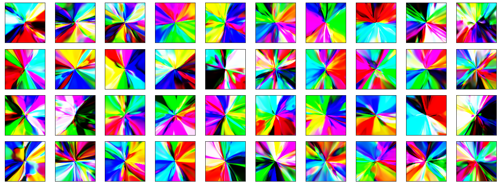

# nn-generative-art

Generative art with neural networks in Pytorch. Read this [Towards Data Science article](https://towardsdatascience.com/making-deep-neural-networks-paint-to-understand-how-they-work-4be0901582ee) and [this post on otoro.net](https://blog.otoro.net/2015/06/19/neural-network-generative-art/), mesmerized by the wild splotches of colour, and decided to dive into this further. WIP.

What I have atm: 