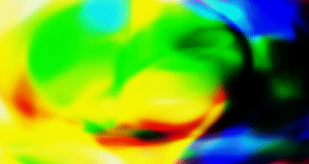

# nn-generative-art

Generative art with neural networks in Pytorch. Read this [Towards Data Science article](https://towardsdatascience.com/making-deep-neural-networks-paint-to-understand-how-they-work-4be0901582ee) and [this post on otoro.net](https://blog.otoro.net/2015/06/19/neural-network-generative-art/), decided to dive into this further.

Replicating work in the blogpost produced this: 

Expanded upon it further to generate smoothly varying frames over time, by sampling trajectories in a latent space. Added image upscaling to get this to run on my Thinkpad X220 at 24 FPS. Example below:



Replicate the Python environment using `conda env create -f environment.yml` or `pip install -r run-requirements.txt`.

Run `python cli.py` to try this out yourself. Press `q` to quit, press `r` to generate a new set of weights. Args as below:

``` bash
(nn-gen-art) tnwei@rama:~/projects/nn-generative-art$ python cli.py -h
usage: cli.py [-h] [--XDIM XDIM] [--YDIM YDIM] [--sampler SAMPLER]
              [--scale SCALE] [--grayscale] [--noframelimit]
              [--kaleidoscope]

optional arguments:
  -h, --help            show this help message and exit
  --XDIM XDIM           Dimension of X, defaults to 160
  --YDIM YDIM           Dimension of Y, defaults to 90
  --sampler SAMPLER     Choose 'random' sampler or 'bezier' sampler to
                        explore the latent space
  --scale SCALE         Scale factor to resize the image, defaults to 4
  --grayscale           Toggle on grayscale output. Default is to use
                        RGB
  --noframelimit        If passed, lifts cap on max frames per second
                        (24fps), not recommended
  --kaleidoscope        If passed, generates top-left quadrant of the
                        image and mirrors across x-y axes for a
                        kaleidoscope effect. Note: Doubles width and
                        height before scale factor is applied
```
